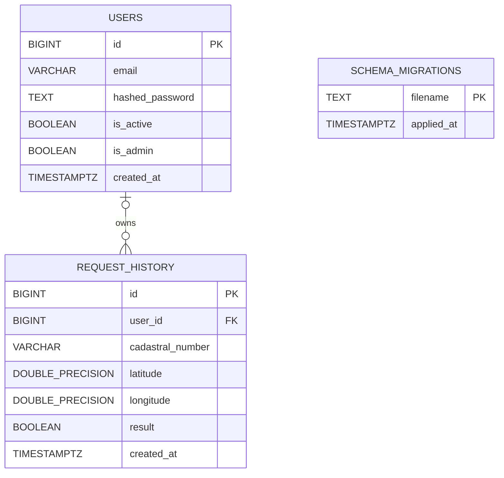

# Database

## Overview

The service uses PostgreSQL as the primary data store. Database access is
performed directly through `asyncpg` with parameterized SQL queries. Schema
changes are stored as raw SQL files in `migrations/` and applied by
`scripts/migrate.py` in deterministic filename order.

The database contains two domain tables and one migration ledger table:

- `users` stores authenticated accounts, password hashes, and authorization
  flags.
- `request_history` stores cadastral check requests and the boolean result
  returned by the external result service.
- `schema_migrations` stores the names of SQL migration files already applied by
  the migration runner.

## Tables

## `users`

Stores application users used by both regular API requests and administrator
access checks.

| Column | Type | Nullable | Default | Description |
| --- | --- | --- | --- | --- |
| `id` | `BIGSERIAL` | No | sequence | Primary key. |
| `email` | `VARCHAR(255)` | No | none | User email. The API normalizes emails to lowercase before insert/login. |
| `hashed_password` | `TEXT` | No | none | PBKDF2-HMAC-SHA256 password hash produced by `hash_password`. |
| `is_active` | `BOOLEAN` | No | `TRUE` | Inactive users cannot authenticate. |
| `is_admin` | `BOOLEAN` | No | `FALSE` | Enables access to `/admin/*` endpoints and admin panel. |
| `created_at` | `TIMESTAMPTZ` | No | `NOW()` | Database-side creation timestamp. |

### Indexes

| Index | Definition | Purpose |
| --- | --- | --- |
| `users_pkey` | `PRIMARY KEY (id)` | Fast lookup by user id. |
| `idx_users_email_lower` | `UNIQUE INDEX ON users (LOWER(email))` | Enforces case-insensitive email uniqueness and supports login lookup by normalized email. |
| `idx_users_created_at` | `INDEX ON users (created_at)` | Supports ordering users by creation time. |

### Constraints

- `id` is the primary key.
- `email`, `hashed_password`, `is_active`, `is_admin`, and `created_at` are
  required.
- `idx_users_email_lower` prevents duplicate email addresses with different
  letter casing.

## `request_history`

Stores the input and result of each successful authenticated cadastral check.
Rows are inserted by `POST /query` after the external result service returns a
valid boolean response.

| Column | Type | Nullable | Default | Description |
| --- | --- | --- | --- | --- |
| `id` | `BIGSERIAL` | No | sequence | Primary key. |
| `user_id` | `BIGINT` | Yes | none | Owner user id. Nullable to preserve history when a user is deleted or for rows created before auth linkage. |
| `cadastral_number` | `VARCHAR(255)` | No | none | Validated cadastral number in four-part colon-separated format. |
| `latitude` | `DOUBLE PRECISION` | No | none | Validated latitude from `-90` to `90`. |
| `longitude` | `DOUBLE PRECISION` | No | none | Validated longitude from `-180` to `180`. |
| `result` | `BOOLEAN` | No | none | Boolean result returned by the external result service. |
| `created_at` | `TIMESTAMPTZ` | No | `NOW()` | Database-side request timestamp. |

### Indexes

| Index | Definition | Purpose |
| --- | --- | --- |
| `request_history_pkey` | `PRIMARY KEY (id)` | Fast lookup by history id. |
| `idx_request_history_cadastral_number` | `INDEX ON request_history (cadastral_number)` | Supports filtering history by cadastral number. |
| `idx_request_history_created_at` | `INDEX ON request_history (created_at)` | Supports chronological ordering. |
| `idx_request_history_user_id` | `INDEX ON request_history (user_id)` | Supports filtering history by owner. |
| `idx_request_history_user_id_created_at` | `INDEX ON request_history (user_id, created_at DESC)` | Supports regular-user history queries ordered from newest to oldest. |

### Constraints

- `id` is the primary key.
- `cadastral_number`, `latitude`, `longitude`, `result`, and `created_at` are
  required.
- `user_id` references `users(id)` through `fk_request_history_user_id`.
- `ON DELETE SET NULL` keeps historical check records when a user is deleted.

## `schema_migrations`

Stores migration filenames already applied by `scripts/migrate.py`. This table is
created by the migration runner before it scans `migrations/*.sql`.

| Column | Type | Nullable | Default | Description |
| --- | --- | --- | --- | --- |
| `filename` | `TEXT` | No | none | Primary key with the migration file name, for example `0001_create_request_history.sql`. |
| `applied_at` | `TIMESTAMPTZ` | No | `NOW()` | Timestamp when the migration was recorded. |

### Indexes And Constraints

- `filename` is the primary key.
- The migration runner inserts a row inside the same transaction that applies a
  pending migration file.

## Relationships

- One user can have many `request_history` rows.
- A history row can have no user because `request_history.user_id` is nullable and
  the foreign key uses `ON DELETE SET NULL`.
- `schema_migrations` is operational metadata and has no foreign keys to domain
  tables.

## Storage Logic

1. User registration writes to `users` and stores only a password hash, never the
   plain-text password.
2. Login reads `users` by normalized email and verifies the PBKDF2 hash.
3. `POST /query` inserts into `request_history` only after successful request
   validation, authentication, external-service call, and response validation.
4. Regular `GET /history` requests filter by `user_id`, so users can only read
   their own saved checks.
5. Admin history endpoints can read across users and filter by cadastral number,
   user id, result, limit, and offset.
6. Database timestamps are generated by PostgreSQL with `NOW()`, which keeps
   creation time independent from application server clock formatting.

## ER Diagram

